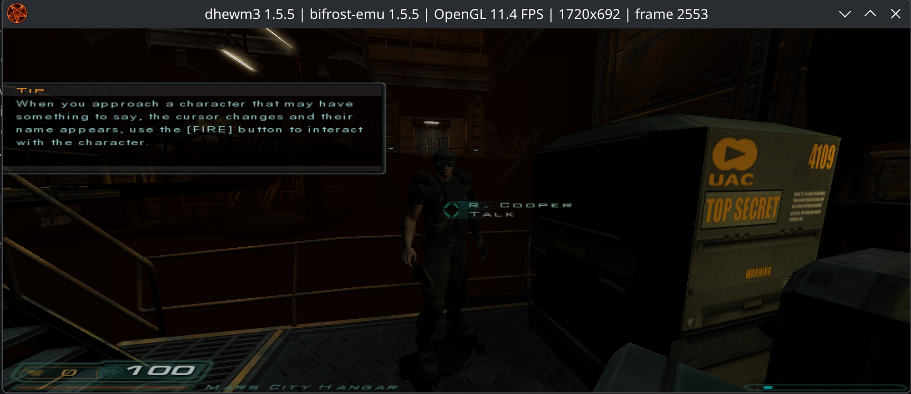
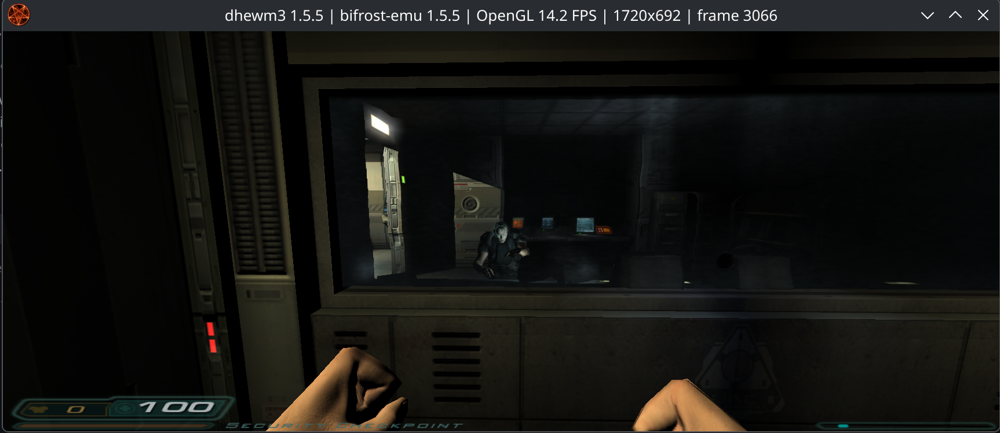

# Doom 3 (dhewm3)

## Current status (2026-10-04)

Default-JIT gameplay, character animation and audio work in the observed demo
sessions, including the user's approximately 27-minute crash-free recording.
New underground saves and a fresh save/load round trip restore successfully;
the older checksum-incompatible save is rejected by the game. Settings,
viewport/cursor behavior, gamepad coverage and demanding-scene frame pacing
remain open. Sustained 5 FPS at 3440×1440 is not yet established by a matched
benchmark.

The latest helper profile sampled 68.07% translated code, 20.69% dispatch/native
helpers, 0.06% translation, zero interpreter samples and 11.19% other work over
30 seconds. This includes worker CPU time and is not main-thread frame-time
attribution or a controlled before/after FPS comparison. See the
[latest profile](#gameplay-profile-after-helper-optimization).

Current full-suite counts and their final-build coverage limits are in
[TESTS.md](TESTS.md): 257/257 JIT, 254/254 interpreter with three JIT-only skips,
then 80/80 JIT unit checks and focused follow-ups after the last helper cleanup.
Older counts and timings below describe intermediate checkpoints.

## Bring-up and correctness history (2026-10-03)

The official dhewm3 1.5.5 Linux ARM64 binary and the free Linux Doom 3
Demo are installed under `rootfs/dhewm3/`. The demo contains
`demo/demo00.pk4`, 483535485 bytes, MD5
`70c2c63ef1190158f1ebd6c255b22d8e`, matching upstream's installation guide.
The downloaded engine and game module are AArch64 ELFs.

**JIT startup reaches the main menu and loads the demo Mars City map.**
The isolated map-load check completes in 64,971 ms and then exits normally
via the requested `+quit`. The user confirmed audible output in the live
copy after the map loaded. The user reports roughly 15 minutes of gameplay
without crashes; the corresponding run ends with normal game shutdown.
The repaired live game now shows consistent character proportions during
NPC speech and movement; low frame rate remains unresolved.
The initial unresolved SDL imports,
missing curl runtime, vector FP compare-zero support, and OpenAL backend-probing null
call have been addressed. The null call came from the glibc `dlerror()` hook
returning zero even after failed library/symbol lookups; OpenAL therefore
accepted an unavailable PipeWire backend and called a null function pointer.

The SDL window-icon crash is also fixed. Doom 3 supplies a 48×48 icon in
read-only `.rodata` to `SDL_CreateRGBSurfaceFrom`; the surface bridge used to
write copied host pixels back into that buffer during creation. It now
publishes metadata separately and writes pixels back when they are modified
(fills and blit destinations), while initializing newly allocated buffers.

The full GL loader batch is repaired: all 337 mandatory and 32 conditional
lookup names resolve in both JIT and interpreter probes, with no scalar
argument mismatches against Khronos `gl.xml`. The real JIT launch initializes
OpenAL 1.25.2 (EFX and 256 voices), selects the ARB2 renderer, uploads its
ARB programs, loads `base.so`, and reaches script initialization. Audio is
still enabled through the normal launcher.

That first batch run exposed another blocker: an invalid generated x86
instruction (`66 0F 38 5F`) during a 32-bit vector multiply. This is repaired
to `PMULLD` (`66 0F 38 40`). The integer arithmetic IR now also preserves Q,
so a 64-bit vector operation clears its upper half. A six-case regression
reproduces SIGILL before the fix and passes in QEMU, interpreter, and JIT
with IR validation and JIT verification. The repaired application displays
the Doom 3 demo title screen and main menu; this does not establish gameplay
stability.

The burger-box collision failure was localized with the exact vertex
normalization instructions from the ARM64 binary. Scalar DUP decoded
`mov s24, v24.s[1]` as a 64-bit element read because it tested imm5 bit 3
before bit 2. It copied X into Y, collapsing distinct collision vertices.
Size now comes from the lowest set bit of imm5, with higher bits selecting
the lane. A separate vector FMOV immediate bug expanded `0.5` as
`0x1f000000` instead of `0x3f000000`; its single-precision exponent prefix
is corrected. Both affected JIT fallback and interpreter execution.

The scalar DUP regression covers all 30 valid lane/width combinations with
source/destination aliasing; the FMOV regression covers all 768 valid
immediate/width combinations. Both pass under QEMU, interpreter and JIT.
The focused five-test SIMD/FP group also passes in both engines. Fixing
FMOV alone did not clear the collision failure; after the scalar DUP fix,
the same demo map passes both burger-box models and finishes loading.

### Character animation correctness

A focused reproduction found vector `FSQRT` executing as `FNEG` in both
engines. The ARM64 `idMath::Init` uses `fsqrt v26.4s,v26.4s` to build its
inverse-square-root seed table; the bad results propagate into quaternion
interpolation and can produce non-unit rotations and model scaling.
Keeping encoding bit 16 and implementing vector square root repairs this
shared fallback. The exact binary instruction sequences for initialization,
quaternion interpolation, matrix conversion/composition and vertex skinning
now match QEMU bit-for-bit on the focused inputs. Animation-frame decoding
also matches across all 64 component flag combinations.

The permanent `jit_simd_unary_fp` regression checks 530 cases, including all
512 table seeds, in QEMU, interpreter and JIT. The repaired live game was subsequently verified: NPC heads, shoulders and
limbs retain consistent proportions during speech and movement, and the user
confirmed that the animation deformation is fixed. This validation covers
the observed demo sequences, rather than every model or animation.
The full JIT unit suite passes 75/75 with IR validation enabled.

The user subsequently confirmed that Doom 3 works well in the repaired live
build. This supports the animation repair and working gameplay; performance and settings limitations remain separately tracked. The later
per-file save-compatibility investigation is recorded under remaining issues.

### Profile-guided math optimization

Starting-map gameplay samples, excluding menu idle, put about 37% of sampled
CPU time in the interpreter and 39% in the broad dispatch bucket. Translation
was effectively idle once the scene was warm. Instruction tracing identified
indexed vector FMUL and vector FNEG in the math workload. Vector indexed
FMUL (2S/4S/2D) and unary FABS/FNEG/FSQRT now have native JIT paths.

The `ctest/bench_doom_vector_fp.c` five-million-iteration multiply/negate
probe, using exact finite inputs,
took 1.15–1.34 seconds with the previous binary and 0.069–0.071 seconds with
the new build, returning identical results. This is an instruction-level
measurement, not a whole-game FPS gain. The indexed regression passes all
28 lane/alias/upper-clearing checks in QEMU, interpreter and JIT; the existing
unary regression passes all 530 checks. The JIT unit suite passes 76/76,
and the complete suite passes 253/253 with desktop and audio access.
Sustained 5 FPS at 3440×1440, including the underground slowdown reported
after roughly 14 minutes, remains unverified. Save loading was unresolved
at this checkpoint; the subsequent October 4 checks establish working newer
saves and a checksum mismatch in an older file.

The next fallback batch adds native FRINTA, signed FCVTAS and scalar lane
copies. The heavily observed rounding pair was located inside guest libm's
`expf`; OpenAL and Doom also contain frequent scalar lane extraction. Native
rounding preserves ties-away, adjacent values, signed zero, NaNs and signed
saturation; lane extraction clears unused bits and handles aliases.

`ctest/bench_doom_round_lane.c` runs two million iterations per phase. Across
three runs, the previous binary took 107–108 ms for the rounding pair and
161–164 ms for three lane copies; the new binary took about 10.2 ms and
3.24–3.30 ms respectively (roughly 10.6× and 49.6× throughput gains). All
outputs match. These are instruction probes, not gameplay FPS measurements.
The rounding regression passes 6,984 checks and scalar lane extraction passes
60 checks in QEMU, interpreter and verified JIT. The complete JIT suite
passes 254/254 with IR validation and desktop/audio access. Its whole-game
benefit still needs a matched-scene comparison.

### Complete interpreted-instruction inventory

`BIFROST_FALLBACK_PROFILE=/tmp/doom-interpreted.tsv` records every observed
interpreted PC/opcode per guest and host thread, without the old top-12 cutoff.
`BIFROST_STATS_PERIOD=5` requests periodic snapshots; normal exit also writes
a final snapshot. Counts are cumulative, and this opt-in diagnostic adds
overhead. Compare successive snapshots to isolate gameplay from initialization.
It includes deliberately interpreted callbacks and thread bodies, rather than
only unsupported JIT instructions. Do not use its FPS as a benchmark or
instruction frequency as CPU-time attribution.

The completed starting-map capture observed 24,989 distinct encodings across
six guest threads. Before this repair, the real IR translator classified 625
encodings as explicit `CALL_INTERP`, spanning 54 assembly mnemonics. All 625
captured encodings now translate without explicit IR fallback and pass actual
JIT execution checks. This covers that capture, not every possible map or all
AArch64 instructions.

Q=0 vector logical operations and `FCCMP/FCCMPE` use inline x86 code.
Exclusive/acquire-release loads and stores use the existing native monitor
helpers. Complex SIMD operations (selection, lane broadcasts/insertion,
narrowing/widening, comparisons, shifts, conversions, reductions, indexed fused
FMLA and vector immediates) use specialized compiled native helpers selected
at translation time. These helpers do not invoke the decoder or interpreter.
Structured vector loads/stores use a native memory helper with alias-safe
snapshots, complete access checking, post-index writeback and signal-PC exit.
They remain Tier-1 boundaries; Tier-2 does not fuse through that fault boundary.

SDL-created guest threads now use the JIT when enabled, retaining interpreter
execution under `--no-jit`. A per-CPU return sentinel stops nested JIT call
helpers and unwinds generated callers before stale cached state can overwrite
a nonlocal return. The SDL regression covers create/wait, eight concurrent
workers, detach and 16 nested `setjmp`/`longjmp` returns. The previously
interpreted `Sys_SleepUntilPrecise()` worker can now execute supported
instructions with JIT. Its previous instruction counts were not CPU-time
measurements or evidence of missing opcode support.

`bash scripts/test_native_doom_gaps.sh` executes all captured encodings with
32 randomized states each: 20,000 checks, zero register/memory mismatches,
and zero explicit IR fallbacks. `ctest/jit_doom_gap.c` adds 2,054 fixed-oracle
checks, including every conditional compare condition and NZCV input for
single/double less/equal/greater/NaN cases. It passes QEMU, interpreter and
verified JIT. Independent QEMU checks also exposed reference-interpreter
errors in FCVTL, SHLL, ADDV result width and fused indexed FMLA; these are
corrected. Verification now retains cross-block flag stores whose elimination
is valid for execution but caused stale boundary-NZCV comparisons.

At this native-gap checkpoint, the full suite passed 255/255 under JIT and 252/252 under interpreter
with three JIT-only skips. SDL thread lifecycle checks pass separately in both
engines. Subsequent live gameplay provides the longer validation below;
instruction probes and suite results alone do not establish a sustained FPS.

`tools/inspect_interpreted_ops.cpp` classifies hex words with the actual decoder
and translator. `TRANSLATED` only excludes explicit IR fallback; code generation
can still fall back for host capability or operand conditions.
`bash scripts/test_fallback_profile.sh` verifies complete concurrent snapshots
and retention after worker exit (192 entries, 192,000 exact counts).

### Extended gameplay and remaining performance work

After the native-gap and SDL-thread repairs, the user completed a roughly
27-minute recorded session without a reported crash, progressing through
Mars City and underground combat. Timestamped frame sampling across the
recording corroborates exploration, dialogue, combat and return to menus.
The user reports gameplay never dropped below about 3 FPS and cutscenes
sustained about 60 FPS. Inspected title samples show 60 FPS in the arrival
sequence and 4.7 FPS in a later combat scene. These are presentation-counter
readings and user observations, not a continuous frame-time benchmark or
proof of a universal minimum FPS.

A fresh 34-second live sampling interval recorded no interpreter samples,
about 59% native JIT and 41% in the broad dispatch bucket, with translation
below 0.1%. The sampler initializes JIT-buffer bounds on one thread and
captures only that initial capacity: worker JIT execution and code beyond
the original buffer can be misclassified as dispatch. Fix per-thread bounds
and growth tracking before treating that bucket as dispatcher-only CPU cost.

The user reports that a stationary scene gets faster after warming up and
that revisiting a scene still stutters. Recompilation is a hypothesis, not
an established cause. Measure translation deltas, cache hits/misses,
invalidation reasons, shader creation, asset I/O and per-frame timing during
cold entry, warm idle and repeat visits. Check that cached code is reused
before choosing eviction, persistence or prewarming changes. The v2.0
[roadmap](../roadmap.md) targets more consistent Doom 3 performance, including
60+ FPS in selected representative scenes where the host permits it.

### Remaining issues

- The recorded session supports approximately 27 minutes of crash-free use,
  not stability across all maps or unlimited runtime. Loading and long-term
  frame pacing need further validation; the earlier isolated map-load check
  took about 65 seconds and user settings can differ.
- The first live gameplay profile exposed a full 64 MiB JIT code buffer,
  repeated compilation of cached interpreter-only call targets and uncached
  overflow failures. The cache now grows in place within a 1 GiB virtual
  reservation, and fallback decisions are cached. The repaired live copy
  crosses 64 MiB, grows to 128 MiB and reports zero overflows. Translation
  sample counts stop increasing in steady execution. SDL workers now run
  with JIT, and a subsequent live interval recorded no interpreter samples.
  Overall frame pacing and correctly attributed dispatch costs remain open.
- The user reports settings options that do not work. Audio was initially
  inaudible, but the user subsequently confirmed sound in the loaded demo.
  Settings behavior remains unresolved.
- The user reports a black strip at the right of the game content and an
  invisible cursor. Viewport sizing and cursor behavior remain unresolved.
- Save compatibility is now checked per file (October 4). The older `tuff.save`
  contains script checksum `b11b4be0`, while current compilation produces
  `b7c8e788`; Doom explicitly rejects that mismatch and restarts the map with
  persistent player data. Both newer underground autosaves contain `b7c8e788`.
  A copied `AutoSave__game_demo_mc_underground.save` restores completely with
  the untouched installed game module, without the map-restart fallback.
  A fresh `checksum_roundtrip` save then reloads successfully, preserving view
  position `(223.75, 593.44, -18.5)` and heading `211.1` degrees exactly.
  Current interpreter and JIT compilation produce byte-identical 67,783-
  statement checksum inputs; native MD4, QEMU and both emulator engines agree
  on their checksum. Earlier emulation producing incompatible script state or
  a wrong checksum is a plausible explanation for the old save, but the exact
  historical change has not been isolated. Do not bypass the checksum guard
  or claim that every older save is recoverable.
- Gamepad mapping and responsiveness have not been validated. Input tracing
  and verification of mouse/keyboard events should precede gamepad tuning.

The cache regression uses three guest threads with thousands of distinct
functions and repeated interpreter-only calls. It passes with a forced
1 MiB budget (one overflow, bounded fallback) and with a growing cache.
A separate regression passes 100 synchronized cross-thread instruction
updates with IC maintenance; QEMU independently validates both guests.
Block-table reads/publication now hold the appropriate lock, negative call
targets are cached, and TLS entries refresh after invalidation. Live-code
patching and Tier-2 publication remain disabled in shared multithread mode.

## GL and OSS compatibility batch

The matching upstream 1.5.5 source declares 337 mandatory entry points in
`neo/renderer/qgl_proc.h`; `R_InitOpenGL` resolves all of them. Another 32
extension names are conditional on driver capabilities and renderer settings.
The repaired missing set is:

- Mandatory: `glMap2d`, `glMapGrid1d`, `glMapGrid2d`, `glTexGend`.
- ARB programs: `glBindProgramARB`, `glGenProgramsARB`, `glProgramStringARB`,
  `glProgramEnvParameter4fvARB`, `glProgramLocalParameter4fvARB`.
- Conditional paths: `glActiveStencilFaceEXT`, `glColorTableEXT`,
  `glDepthBoundsEXT`, `glStencilOpSeparateATI`.

`glDebugMessageCallbackARB` already resolves through the core-name alias and
GLES registration. The audit includes both GL and GLES registration rows.

Typed dispatch fixes the 23 originally identified scalar float signatures,
plus `glTexCoord1f`, `glTexCoord3f`, and `glTexCoord4f` found while regenerating
the table. Related generated `glMultiTexCoord1f/3f/4f` and
`glSecondaryColor3f` rows also use their correct FP signatures. Evaluator
buffers include target components and stride padding; shader strings and
parameter vectors use exact input extents, and program IDs use output-only
buffers. Owned staging buffers are capped at 16 MiB. Read-only input buffers
are never written back.

OSS `/dev/dsp` now supports the playback contract used by OpenAL: fragment,
format, channel and rate negotiation; free-buffer reporting; reset,
nonblocking mode and output triggers. Each open descriptor owns a mixer
stream. Writes return accepted bytes, full nonblocking queues return EAGAIN,
and `ppoll` reports output readiness as the host mixer consumes audio.
Recording is unsupported.

`scripts/test_doom3_compat.sh` checks every repaired typed GL call with host
ABI oracles, all nine targets for float/double 1D/2D evaluators, read-only
sparse buffers ending at guard pages, buffers larger than 64 KiB, program
outputs and invalid evaluator parameters. Its OSS test checks negotiated
formats, partial writes, full queues, descriptor independence, guarded ioctl
outputs, reset and actual poll-driven queue consumption with SDL dummy audio.
Both tests pass in both engines. The unit suite passes 70/70 under JIT with
IR validation and 69/69 under the interpreter (one JIT-only test skipped).
The runner initially detected a stale memory-guard ELF; rebuilding that
fixture cleared the only reported failure. Existing SDL/GL/Vulkan and
read-only SDL surface regressions also pass in both engines; existing audio/pipe runner
checks pass 3/3 in each engine.

Repeat the source audit and generate the complete guest lookup probe:

```bash
python3 scripts/check_doom3_gl.py --source /path/to/dhewm3-1.5.5 \
  --emit-probe /tmp/doom3-gl-lookup.c
make cross SRC=/tmp/doom3-gl-lookup.c OUT=/tmp/doom3-gl-lookup.elf
(cd /tmp && env -u BIFROST_ROOT /absolute/path/to/bifrost-emu ./doom3-gl-lookup.elf)
scripts/test_doom3_compat.sh
```

The lookup probe establishes registration coverage, not rendering correctness.
The runtime checks exercise the repaired APIs; they do not certify every
legacy GL pointer policy or every advertised extension. Sources:
[mandatory loader list](https://github.com/dhewm/dhewm3/blob/1.5.5/neo/renderer/qgl_proc.h),
[renderer initialization](https://github.com/dhewm/dhewm3/blob/1.5.5/neo/renderer/RenderSystem_init.cpp),
[OpenAL OSS playback contract](https://github.com/kcat/openal-soft/blob/1.25.2/alc/backends/oss.cpp).

## Local launch

```bash
./rootfs/dhewm3/run-bifrost.sh
```

The launcher uses the default JIT, a window, guest-relative data/save paths,
and a private library directory. Private Debian ARM64 runtimes supply
libcurl 7.88.1 (bookworm), its matching LDAP/LBER libraries, and librtmp;
other dependencies come from the existing guest rootfs. These binaries and
the demo data are ignored local assets, not repository source.

Sources: [official release](https://github.com/dhewm/dhewm3/releases/tag/1.5.5),
[demo installation/checksum](https://dhewm3.org/#using-the-doom3-demo-gamedata),
[Debian curl packages](https://deb.debian.org/debian/pool/main/c/curl/).

## Emulator changes and verification

- Added `glMap1d` with typed mixed integer/double dispatch and input-only
  control-point staging. The buffer extent includes stride padding and all
  target-specific components, capped at 16 MiB. Tests cover both lookup
  paths, all nine targets, read-only sparse buffers ending at guard pages,
  a buffer larger than 64 KiB, and invalid GL parameter forwarding. The
  SDL/GL/Vulkan compatibility script passes in both engines. Doom 3 now
  passes the `glMap1d` loader check; the batch repair above now also covers
  the remaining loader imports.

- Fixed read-only external SDL surface pixels. The surface regression covers
  both From constructors, metadata and lock operations, duplication, and
  read-only blit sources. Fills and blits still update writable caller-owned
  destinations. `scripts/test_sdl_surface_format.sh` and the SDL/GL/Vulkan
  compatibility checks pass in both JIT and interpreter modes.

- Wired the glibc `dlerror()` hook to the existing guest error-string handler.
  Failed `dlopen`/`dlsym` now expose an error, and reading it consumes it.
  The added regression failed before the repair and passes in both engines;
  focused loader checks (`test_dlopen`, `test_dlopen_mt`, `test_dladdr`,
  `test_dladdr_glibc`) pass 4/4 in JIT and interpreter mode.
- Added 28 SDL2 imports, including window/display queries, controller metadata,
  string returns, condition signaling, and guest thread identifiers. x86 and
  AltiVec CPU queries return false for the AArch64 guest. Guest SDL thread
  handles are never passed to host SDL_GetThreadID.
- Sized sparse output bounces for window coordinates, display DPI/modes,
  text rectangles and gamma ramps. Guarded output regressions check adjacent
  bytes survive calls.
- Implemented vector FCMEQ/FCMGE/FCMGT/FCMLE/FCMLT against zero in the
  interpreter; the JIT uses its existing interpreter fallback. Q=0 clears
  the upper half, ordered NaN comparisons are false, and signed zeros compare
  equal. `ctest/jit_fp_compare_zero.c` passes 105 checks in QEMU, JIT, and
  interpreter mode with fixed independent expected masks.
- `scripts/run_thunk_compat.sh` passes SDL/GL/Vulkan in both engines.
  `test_sdl_thread` checks worker identity matches the guest handle's ID and
  differs from the main thread. Focused comparison/shift/permute/thread
  runner selections pass 4/4 in each engine. SDL header signature audit
  reports zero errors; generated thunk table and whitespace checks pass.

Local diagnostic logs for this attempt are in `/tmp/bifrost-dhewm3-*.log`,
`/tmp/dhewm-compat.log`, and `/tmp/dhewm-focused*.log`. The repaired loader's
startup trace is `/tmp/doom3-dlerror-fixed.log`; focused loader results are
`/tmp/dlerror-focused.log` and `/tmp/dlerror-focused-interp.log`.

The icon repair startup trace is `/tmp/doom3-icon-fixed.log`; regression
results are `/tmp/icon-regression.log` and `/tmp/icon-thunk-compat.log`.

The `glMap1d` startup trace is `/tmp/doom3-map1d-fixed.log`; compatibility
results are `/tmp/map1d-compat.log`. Generated thunk, SDL header and GL XML
checks pass.

Batch validation logs: `/tmp/doom3-batch-tests2.log`,
`/tmp/doom3-gl-lookup-fixed-jit.log`, `/tmp/doom3-gl-lookup-fixed-interp.log`,
`/tmp/doom3-audio-existing-jit.log`, and `/tmp/doom3-audio-existing-interp.log`.
The initial batch startup trace is `/tmp/doom3-batch-fixed.log`; its core
dump identified the invalid multiply opcode. The multiply repair startup
trace is `/tmp/doom3-batch-jit-fixed.log`.

## Dispatch-cache performance checkpoint (2026-10-04)

The JIT now retains 2,048 per-thread targets in two-way sets, uses shared-lock
hits for existing multithreaded call targets, and avoids revoking dispatch
entries for data-only mapping changes. Worker profiler registration also
covers all participating host threads and the reserved cache-growth range.
See [JIT.md](JIT.md) for contracts and remaining attribution limitations.

On an AMD Ryzen 7 5800X3D host (8 cores/16 threads), a targeted
conflicting-address indirect-call workload completed with identical
results and measured a 2.32× speedup (three alternating baseline/new runs;
median 1.321 s versus 0.570 s). This is a dispatch microbenchmark, not a Doom 3
FPS result. The workload uses `ctest/jit_dispatch_cache.elf 500000`,
three guest threads and 12 million indirect calls. A matched underground
autosave load plus 120-frame smoke run at
3440×1440 (windowed, swap interval 0, diagnostic audio disabled) took 81.5 s
before and 80.8 s after; both ended at the same reported
position and heading. That single comparison does not establish a meaningful
in-game improvement, sustained 5 FPS, or 60 FPS gameplay. The Doom smoke timing predates the final
data-only invalidation refinement; the indirect-call measurements use the
final build and include the fixture's data mapping churn. Further
matched gameplay/frame-time profiling is required for those performance goals.

## Helper-call optimization checkpoint (2026-10-04)

Nested guest calls now batch their shared statistics instead of flushing
atomics on every return. BL/BLR helper wrappers omit redundant host flag
preservation after publishing guest NZCV, and BL avoids a duplicate return-PC
write. Callback stop guards and register/vector publication remain intact.

On the Ryzen 7 5800X3D, three alternating baseline/optimized trials of
`jit_call_helpers.elf 2000000` measured median 1.246 s versus 0.645 s
(**1.93× faster**) with identical results. The three-thread workload makes
42 million nested calls; it isolates short-call overhead and is not a
Doom FPS measurement. The optimized build was subsequently launched with the
latest underground autosave, audio, title statistics and CPU profiling at
3440×1440, without a runtime limit. See [JIT.md](JIT.md) and
[TESTS.md](TESTS.md) for contracts, oracle checks and verifier limitations.

### Gameplay profile after helper optimization

A 30-second interval near the end of the optimized run retained 5,095 CPU
samples: translated code 3,468 (68.07%), dispatch/native helpers 1,054
(20.69%), translation 3 (0.06%), interpreter 0 and other host work 570
(11.19%). Dispatch/helper share was 24.5% in the earlier 67.64-second
NPC capture. The scenes and durations differ, so this reduction is encouraging
but does not establish a controlled gameplay speedup or an FPS multiplier.
These are process CPU samples, including workers, rather than main-thread
frame-time attribution. The dispatch bucket includes native helper work.

The last cache report contained 67,318 blocks and 80,465,832 emitted bytes,
with a 128 MiB logical capacity, one growth and zero overflows or budget
fallbacks. The run reached normal game/audio/graphics shutdown and the process
exited normally. Terminal logging recorded rendering startup and CPU reports,
but no FPS history, so sustained FPS cannot be reconstructed from this log.
The local diagnostic log is `/tmp/doom3-helper-play-20261004.log`.

## Gameplay screenshots (2026-10-04)

User-supplied Mars City hangar and security-checkpoint screenshots show an NPC, interaction prompts, lighting and HUD rendering. Window stats report 1720×692 with instantaneous presentation samples of 11.4 and 14.2 FPS; these are not sustained benchmarks or proof of animation correctness.




