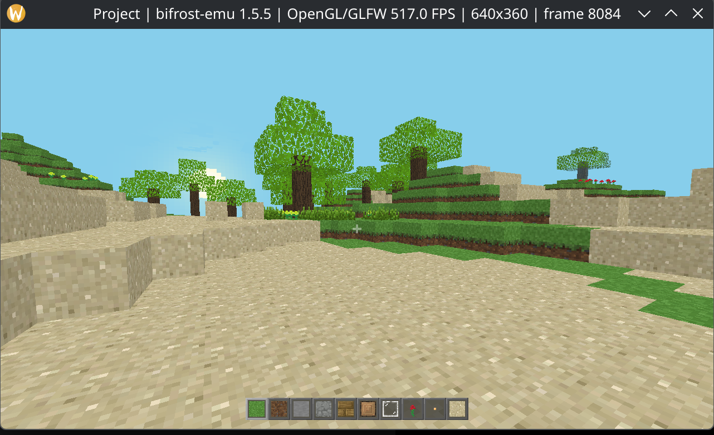
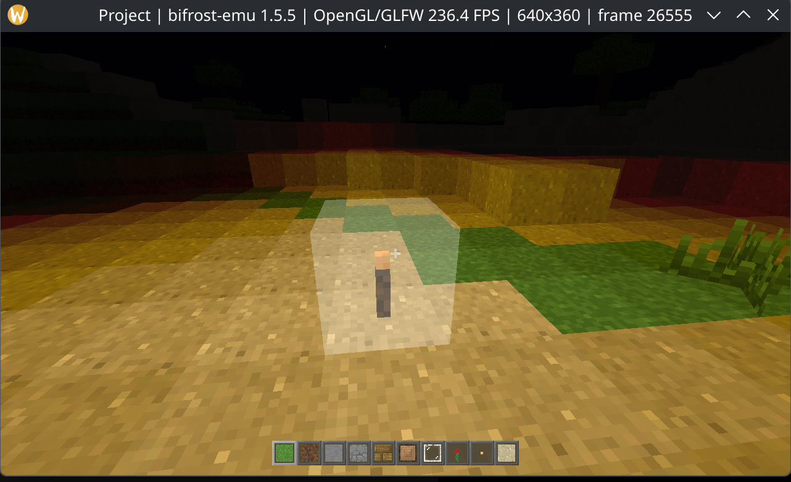

# Minecraft Weekend

## Current status (2026-10-03)

The user reports stable gameplay and reconfirmed that the game works after
launching with the repaired emulator. Chunk rendering can be laggy. The
suspected cost of guest allocation/brk activity has not been established by
this gameplay confirmation.

## Running

Run from the game directory so its resources resolve:

```sh
cd ctest_real/minecraft_weekend
../../bifrost-emu ./minecraft_weekend.elf
```

The locally built static ARM64 executable uses the GLFW/OpenGL thunk bridge.
Keep the `res/` directory with the executable. This is an interactive gameplay
checkpoint, rather than exhaustive validation of every world or input path.

## Gameplay checkpoint (2026-10-04)

User-supplied daytime gameplay shows terrain, trees and the hotbar. Window stats report an internal render size of 640×360. The FPS in the title is an instantaneous presentation sample, not a sustained benchmark.




