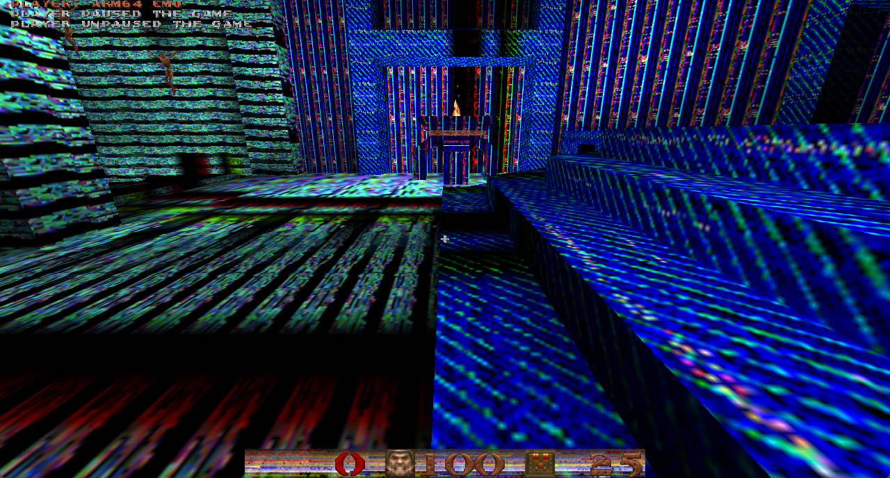

# vkQuake

On 2026-10-02 the user confirmed working gameplay with the repaired default
JIT build and supplied four screenshots showing the world, HUD, main menu,
help, and load menu. This is a Vulkan game bring-up milestone, with remaining
camera and rendering issues at that checkpoint; it is not a claim of
complete compatibility. The latest input report is recorded below.

## Latest input follow-up (2026-10-04)

The user subsequently reported that the mouse issue was resolved. A connection
with the Doom 3 fixes is suspected by the user but has not been established.
Treat the excessive-sensitivity notes below as historical repro evidence;
repeatable axis/sensitivity/focus checks remain pending. Texture corruption
is still unresolved.

## Earlier gameplay check (2026-10-03)

The user confirmed that vkQuake still runs after the interpreter decode-cache
repair, but texture corruption and camera issues remain. This is a working
launch/gameplay checkpoint, not confirmation that those issues are fixed.

## Historical screenshot checkpoint (2026-10-03)

Follow-up on 2026-10-03: the mapped-memory synchronization repair substantially
improved texture colors in the user's screenshot. The user subsequently
reported some remaining texture corruption and excessively high sensitivity;
neither rendering nor camera behavior is considered fully repaired. The
mapped-memory regression passes in both engines, including preservation of
pending uploads and GPU readback. Further debugging must preserve the user's
active gameplay session; diagnostic relaunches previously interrupted play.

- Gameplay and menus work according to the user.
- In a later checkpoint the user reported no sudden crashes during continued
  play. Session duration was not measured; this is observed interactive
  stability, not a completed soak test. The user also noted that additional
  unknown issues may remain.
- The later console screenshot shows pause/unpause, saving to `./id1/s0.sav`
  followed by `done.`, and repeated loading from that save. These paths were
  exercised, but saved-state fidelity has not been independently checked.
- Mouse camera sensitivity is much too high.
- The user reports a camera issue in the automatically played gameplay too.
  That sequence is demo playback (a prerecorded game). Its view angles are
  read from the demo in `Quake/cl_demo.c`, so ordinary mouse sensitivity
  alone is not established as the cause of both symptoms.
- The supplied JIT screenshots show strong blue/multicolor texture artifacts
  across walls, floors, and parts of the HUD. Texture corruption therefore
  affects the default JIT run too, not only the interpreter as previously
  recorded. The screenshots do not establish its cause.
- Interpreter mode reaches the demo, but clean rendering remains unverified.

Saved evidence: [gameplay](images/vkquake-2026-10-02/gameplay.png),
[main menu](images/vkquake-2026-10-02/menu.png),
[help](images/vkquake-2026-10-02/help.png), and
[load menu](images/vkquake-2026-10-02/load.png).
Later checkpoints: [console with save/load activity](images/vkquake-2026-10-02/console-save-load.png)
and [improved textures with remaining artifacts](images/vkquake-2026-10-03/texture-repair-probe.png).

All saved screenshots are cropped to game content, removing the surrounding
desktop/video and window title bar. Game pixels are retained without resizing
or retouching.



Run the locally staged AArch64 binary and shareware data from the repository:

```sh
cd rootfs/vkquake
BIFROST_ROOT="$(realpath ..)" ../../bifrost-emu ./vkquake -basedir .
```

Add `--no-jit` before `./vkquake` to run the interpreter.

## SDL input filter repair (2026-10-03)

The emulator previously ignored `SDL_SetEventFilter` and reported no filter
from `SDL_GetEventFilter`. Guest filters now run through a host callback
bridge: their return value controls event rejection, and their callback and
userdata round-trip through the getter. Callback execution preserves guest
registers and uses separate scratch stacks/events for nested SDL calls.
Host event threads receive isolated guest CPU/TLS state.

The regression covers signed mouse deltas, relative output canaries,
registration/getter/removal, accepted/rejected motion, and nested pushes.
It also exercises callback stacks above the direct window; those now protect
sparse guest pages without indexing the direct page table. Small SDL event
and integer-output bounces use their exact ABI sizes to avoid crossing stack
guards. `scripts/run_thunk_compat.sh` passes SDL/GL/Vulkan in both engines.

This repairs the confirmed event-filter defect. Subsequent interactive runs
still showed excessive sensitivity. Horizontal turning was seen in captures,
but the user could not confidently assess it because of the large camera
response. Input remained unresolved at that checkpoint; the later user
report above supersedes that status.

## Historical sensitivity investigation (through 2026-10-03)

A bounded SDL capture (`BIFROST_INPUT_TRACE=1`) showed signed horizontal
movement arriving in relative mode. `BIFROST_INPUT_WATCH` accepts up to 32
comma-separated guest addresses and logs changed 32-bit values at SDL polls.
The live vkQuake capture loaded sensitivity 0.2 and FOV 90; yaw changed by
small angles. This does not establish that the visible camera is correct.

Exact compiled mouse-motion, camera, angle, rotation, and matrix routines
passed isolated numerical checks. The glibc-linked probe exposed a separate
SSHL/USHL bug: both use a signed low-byte shift count, including USHL's
logical right shift for negative counts. The interpreter previously treated
USHL as left-only and used whole-lane SSHL counts. JIT fallback shares this
handler. `ctest/jit_shift_register.c` covers both operations, valid Q forms,
all lane sizes, destination aliasing, out-of-range counts and ignored upper
count bits: 182 checks pass under QEMU and both repaired engines. The old
engines fail USHL by -1. The compiled glibc view probe now also passes with
its original vectorized call-stub builder.

At that time, the user confirmed excessive sensitivity after the shift repair.
The repair fixed a demonstrated instruction bug without resolving that
observed camera behavior. The later resolution has not been traced to a
specific fix.

The final gameplay segment of the 2026-10-03 recording shows sharp camera
swings between floor and ceiling. The greyed-out vkQuake window at the end
belongs to a separate instance, as clarified by the user; it is not evidence
that the active gameplay instance hung. The recording does not measure
physical mouse movement or establish the remaining bug's cause.

## Pointer corruption fixed

At the time of this reproduction, SDL renderer workers used the interpreter
even during a default JIT run. They now use JIT in default mode; explicit
`--no-jit` retains interpreter execution.
In `Sky_DrawSky`, `fcsel s31,s25,s24,gt` at guest PC `0x4329b4` matched an
obsolete, overly broad FP-to-integer conversion handler. It wrote the GPR
zero-register slot instead of FP register 31. Subsequent pointer copies using
XZR then added one, corrupting Vulkan handles and eventually faulting.

Removed the duplicate handler: the existing scalar conversion handler already
distinguishes legal conversions from FCSEL. FP moves and conversions now also
discard writes to GPR register 31 while retaining valid FP register 31 writes.
Thread exception reports include guest PC, SP, and LR.

`ctest/jit_fcsel_high_regs.c` checks high source registers, FP destination 31,
both widths and branch outcomes, aliasing, GPR preservation, and discarded XZR
writes. All 61 checks pass under QEMU, JIT, and interpreter. The saved pre-fix
binary fails the first check and then crashes. The focused FP suite passes
12/12 in each emulator mode.

This reproduction supersedes the earlier stale-guest-state diagnosis. Working
JIT gameplay alone does not establish long-run stability. Texture artifacts
remain open; input status follows the later user report at the top of this
document.
